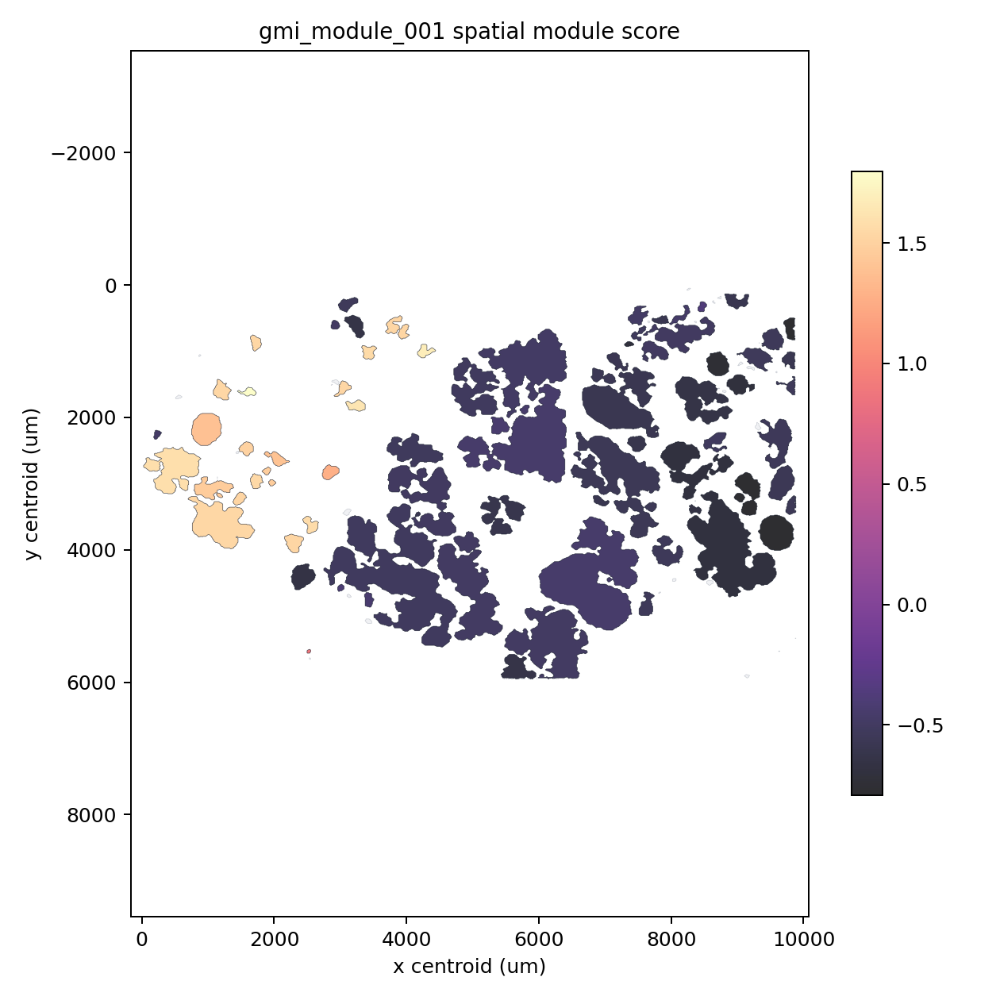
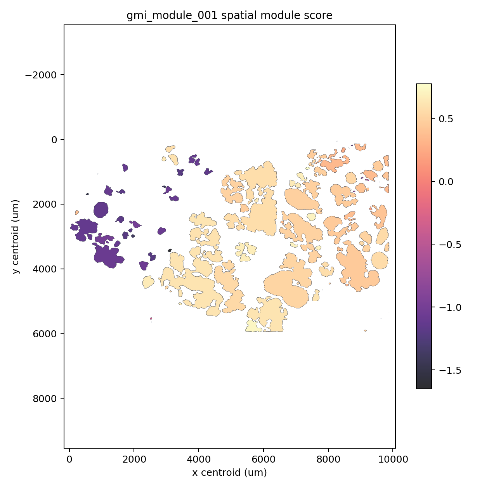

# GMI spatial gene modules

This tutorial documents the WTA breast spatial module layer built on top of
`pyXenium.gmi`. The module workflow starts from a completed contour-GMI run and
does not rerun the vendored R `Gmi` fit.

```bash
pyxenium gmi modules \
  --gmi-output-dir pyxenium_gmi_outputs/full_contour_top500_spatial100 \
  --output-dir pyxenium_gmi_outputs/full_contour_top500_spatial100/modules
```

## Biological question

The primary question is whether the validated S1/S5 GMI effects form a coherent
spatial gene module. In the Atera WTA breast task, `S1` is the invasive
tumor/CAF endpoint and `S5` is the apocrine-luminal DCIS endpoint.

The module validation asks:

- whether `NIBAN1` and `SORL1` collapse into one S5/DCIS module;
- whether RNA-only and no-coordinate controls preserve that module;
- whether spatial-only modules are driven by composition, rim/edge, CAF/ECM,
  vascular/pericyte, immune context, or coordinate features;
- whether top1000 and all-nonempty sensitivity runs change the QC20 conclusion.

## Method

Each supervised GMI module is seeded by selected or bootstrap-stable GMI main
effects. The seed is expanded with three evidence sources:

- feature correlation across retained contours;
- contour-neighborhood spatial-lag correlation;
- GMI interaction edges from `interaction_effects.tsv`.

The module score is written per contour, oriented toward the endpoint in
`score_high_label`, and summarized with curated pathway overlaps and Moran's I /
Geary's C spatial autocorrelation.

## Outputs

Each module run writes a `modules/` directory containing:

- `spatial_modules.tsv`
- `module_features.tsv`
- `module_scores.tsv.gz`
- `module_enrichment.tsv`
- `module_interactions.tsv`
- `module_spatial_autocorr.tsv`
- `effect_graph_nodes.tsv`
- `effect_graph_edges.tsv`
- `summary.json`
- `report.md`
- optional score maps under `figures/`

## PDC validation

The final WTA breast module tutorial is generated from a fresh PDC Dardel
8-stage run under:

```text
/cfs/klemming/scratch/h/hutaobo/pyxenium_gmi_modules_2026-04-30
```

The stages are:

| Stage | Purpose |
| --- | --- |
| `smoke_contour_top200_spatial50` | Fast smoke run and module artifact check |
| `full_contour_top500_spatial100` | Primary QC20 RNA + spatial model |
| `full_contour_top500_spatial100_stability` | Spatial CV, bootstrap, and controls |
| `validation_rna_only_qc20` | RNA-only module control |
| `validation_spatial_only_qc20` | Spatial-feature-only module control |
| `validation_no_coordinate_qc20` | Coordinate-confounding control |
| `sensitivity_top1000_spatial100_qc20` | Expanded RNA feature budget |
| `sensitivity_all_nonempty_top500_spatial100` | Low-cell contour sensitivity |

## Final PDC validation results

The fresh PDC Dardel module validation completed all 8 stages on 2026-05-01
under:

```text
/cfs/klemming/scratch/h/hutaobo/pyxenium_gmi_modules_2026-04-30
```

The submitted Slurm job chain was `20207833` through `20207840`. The final
summary artifacts are:

```text
/cfs/klemming/scratch/h/hutaobo/pyxenium_gmi_modules_2026-04-30/reports/pdc_gmi_module_validation_summary.json
/cfs/klemming/scratch/h/hutaobo/pyxenium_gmi_modules_2026-04-30/reports/pdc_gmi_module_validation_summary.md
```

| Stage | Contours | Features | Selected main effects | Train AUC | CV mean AUC | Modules |
| --- | ---: | ---: | --- | ---: | ---: | ---: |
| Smoke top200+spatial50 | 80 | 250 | none | 0.50 | - | 0 |
| Full QC20 top500+spatial100 | 80 | 600 | `NIBAN1`, `SORL1` | 1.00 | - | 1 |
| Stability QC20 top500+spatial100 | 80 | 600 | `NIBAN1`, `SORL1` | 1.00 | 1.00 | 1 |
| RNA-only QC20 | 80 | 500 | `NIBAN1`, `SORL1` | 1.00 | 1.00 | 1 |
| Spatial-only QC20 | 80 | 100 | luminal-like amorphous DCIS composition | 0.98 | 0.93 | 2 |
| No-coordinate QC20 | 80 | 600 | `NIBAN1`, `SORL1` | 1.00 | 1.00 | 1 |
| Top1000 QC20 | 80 | 1100 | `EFHD1`, `SORL1` | 1.00 | 1.00 | 1 |
| All-nonempty top500+spatial100 | 102 | 600 | 11q13 invasive tumor composition | 0.95 | 0.95 | 1 |

## Selected modules

| Stage | Module | Score-high label | Anchors | Features | RNA/spatial | Moran's I | Geary's C | Gene-set overlap |
| --- | --- | --- | --- | ---: | --- | ---: | ---: | --- |
| Full QC20 | `gmi_module_001` | S5 | `NIBAN1`, `SORL1` | 30 | 23/7 | 0.758 | 0.270 | DCIS apocrine-luminal; 11q13 |
| Stability QC20 | `gmi_module_001` | S5 | `NIBAN1`, `SORL1` | 30 | 23/7 | 0.756 | 0.270 | DCIS apocrine-luminal; 11q13 |
| RNA-only QC20 | `gmi_module_001` | S5 | `NIBAN1`, `SORL1`, `EFHD1` | 30 | 30/0 | 0.744 | 0.276 | DCIS apocrine-luminal; 11q13 |
| No-coordinate QC20 | `gmi_module_001` | S5 | `NIBAN1`, `SORL1` | 30 | 23/7 | 0.756 | 0.270 | DCIS apocrine-luminal; 11q13 |
| Spatial-only QC20 | `gmi_module_001` | S5 | luminal-like amorphous DCIS fractions | 30 | 0/30 | 0.887 | 0.162 | composition module |
| Spatial-only QC20 | `gmi_module_002` | S5 | contour compactness | 16 | 0/16 | 0.078 | 0.892 | geometry module |
| Top1000 QC20 | `gmi_module_001` | S5 | `SORL1`, `NIBAN1`, `EFHD1` | 30 | 23/7 | 0.766 | 0.261 | DCIS apocrine-luminal |
| All-nonempty | `gmi_module_001` | S1 | 11q13 invasive tumor fractions | 30 | 20/10 | 0.628 | 0.380 | QC sensitivity module |

## Representative module maps

The primary QC20 module is a spatially autocorrelated S5/DCIS module anchored by
`NIBAN1` and `SORL1`.


The RNA-only and no-coordinate controls retain the same S5/DCIS module pattern.
This argues that the primary module is carried by expression structure rather
than direct slide coordinates.




The spatial-only run is predictive, but its leading module is driven by
luminal-like amorphous DCIS composition across the whole contour, inner rim, and
core. It should be interpreted as contour context rather than an independent RNA
program.


The top1000 sensitivity keeps the same S5/DCIS axis and adds `EFHD1` as an
expanded RNA-budget anchor.


The all-nonempty sensitivity changes the sparse model: when contours with at
least one cell are allowed, the module shifts toward S1 11q13 invasive tumor
composition. This is a QC sensitivity warning and does not replace the QC20
primary model.



## Biological interpretation

The release-level interpretation is that the QC20 S1 invasive tumor/CAF versus
S5 apocrine-luminal DCIS contrast is primarily an S5/DCIS RNA expression module
anchored by `NIBAN1` and `SORL1`. The module survives both RNA-only and
no-coordinate validation, so it is not explained away by direct coordinate
features or by the spatial feature block.

The spatial-only result is informative but different: it recovers a strong
luminal-like amorphous DCIS composition module, with no evidence that coordinate
features are the main driver. This means spatial contour context predicts the
endpoint, but the biological claim should be phrased as endpoint composition and
microanatomic context, not as a separate CAF/ECM, vascular, immune, or
coordinate artifact.

The expanded top1000 run supports the same S5/DCIS program and introduces
`EFHD1`, consistent with an apocrine/luminal DCIS expression axis. Bootstrap
stability remains strongest for `NIBAN1` and `SORL1` (`0.7` and `0.5` selection
frequency in the stability stage), with weaker one-off support for `CCND1`,
`EFHD1`, and several additional genes.

The all-nonempty sensitivity is deliberately not the primary result. It admits
102 contours instead of the QC20 set of 80 and switches the selected module to
S1 11q13 invasive tumor composition. That change shows why 0-cell and very
low-cell contours should remain excluded from the main GMI fit: they can let
composition features dominate the sparse model.

CAF/ECM remodeling, angiogenesis/pericyte, myeloid-vascular context, Notch,
IGF/MAPK, Wnt, TGF-beta, CXCL12/CXCR4, and CSF1/CSF1R were not selected as
primary module drivers in this WTA breast validation. They remain useful
candidate gene-set annotations for larger cohorts, perturbation studies, or
multi-region validation.
