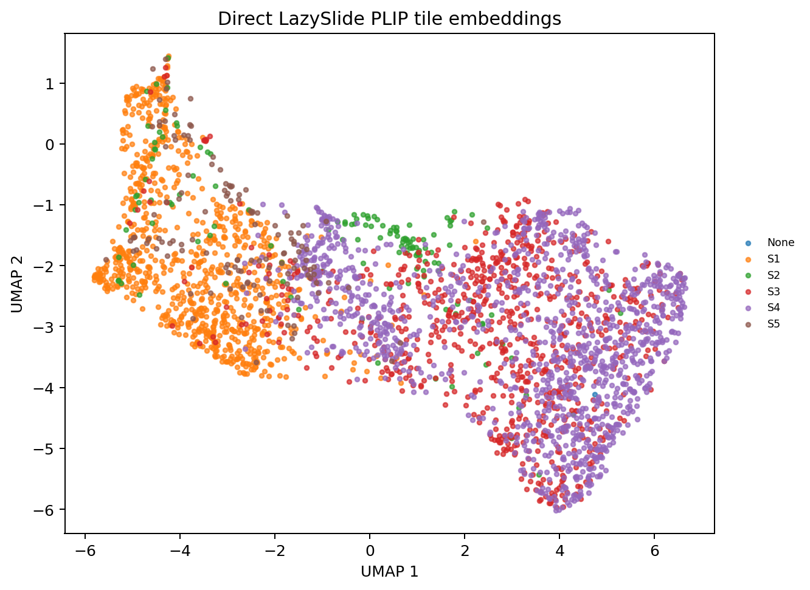
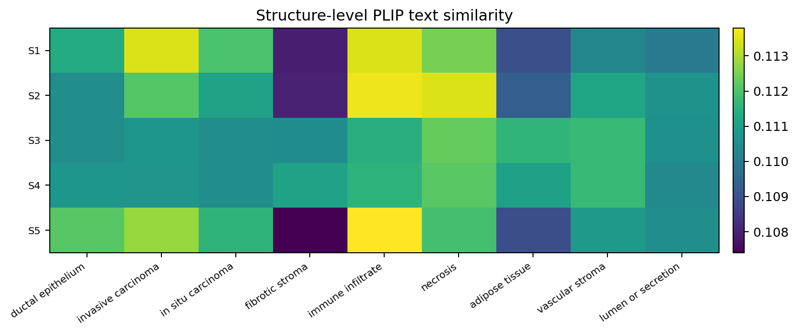
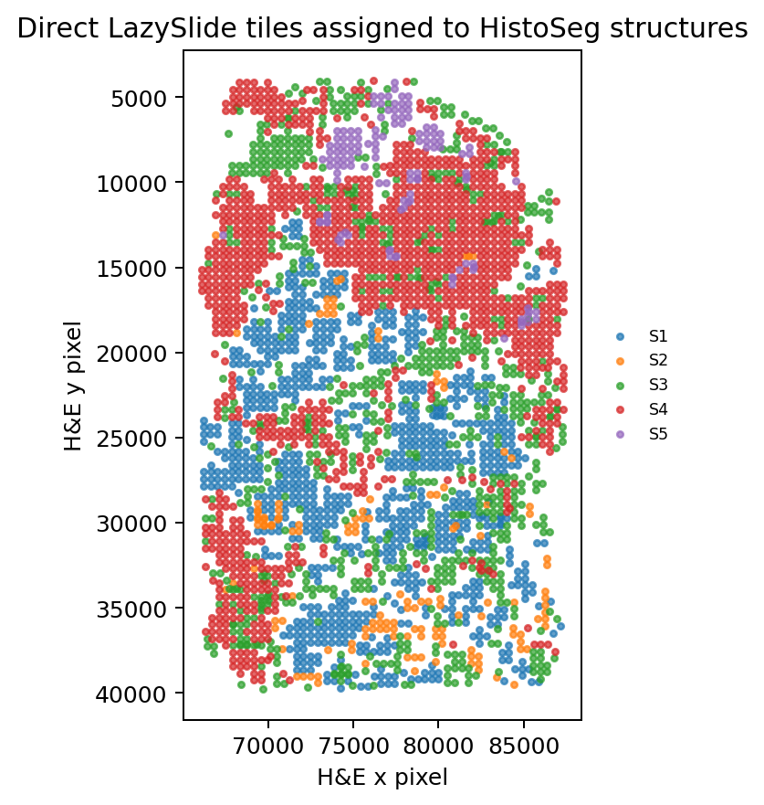
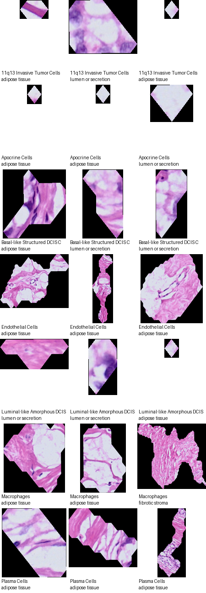

# Breast WTA HistoSeg + LazySlide image features

## Overview

This tutorial documents the upgraded RNA + HistoSeg structure + H&E image
workflow for the Atera breast WTA Xenium sample. HistoSeg provides tissue
structure contours, LazySlide provides WSI tile embeddings and vision-language
prompt-similarity scores when the selected model supports text embeddings, and
`pyXenium.multimodal` aggregates those outputs into structure-level image/RNA
association tables.

The pyXenium side is intentionally a thin integration layer. It does not run
HistoSeg segmentation and it does not vendor LazySlide image-model code.

## Biological question

For each HistoSeg structure in the breast WTA sample:

- Which foundation-model image features distinguish this structure from the
  other structures?
- Which PLIP/CONCH/OmiCLIP prompt terms are enriched in the tiles assigned to the
  structure?
- Do structure-level H&E features align with Xenium RNA programs and boundary
  hypotheses?

## Workflow boundary

| Package | Responsibility |
| --- | --- |
| HistoSeg | Structure segmentation, contour/ROI GeoJSON, mask QC |
| LazySlide | WSI opening, H&E tiling, pathology foundation model feature extraction, optional vision-language prompt scoring, spatial tile domains |
| pyXenium | Xenium/H&E alignment, tile-to-structure assignment, structure aggregation, RNA/image association |

## Python API

```python
from pyXenium.multimodal import run_histoseg_lazyslide_structure_workflow

result = run_histoseg_lazyslide_structure_workflow(
    "/path/to/WTA_Preview_FFPE_Breast_Cancer_outs",
    contour_geojson="/path/to/xenium_explorer_annotations.s1_s5.generated.geojson",
    contour_key="histoseg_structures",
    output_dir="/path/to/a100/run",
    he_source_path="/path/to/WTA_Preview_FFPE_Breast_Cancer_he_image.tiffslide_pyramid.tif",
    wsi_reader="tiffslide",
    model="plip",
    text_model="plip",
    tile_px=224,
    mpp=0.5,
    device="cuda",
    batch_size=64,
    table_format="parquet",
)
```

`model` is the LazySlide image/foundation model used for tile embeddings. It can
be any model supported by the local LazySlide installation, for example `plip`,
`conch`, `uni`, `uni2`, `gigapath`, `virchow`, or related model-zoo entries.
`text_model` is separate and is only used for tile-level prompt scoring. It must
share the same image-text latent space as the image model. In practice,
`text_model="plip"` is valid with `model="plip"` and `text_model="conch"` is
valid with `model="conch"`. Vision-only encoders such as UNI, Virchow, or
GigaPath produce embeddings and spatial domains but do not automatically assign
pathology names. Use `text_model="none"` to disable prompt scoring explicitly.

The workflow writes:

```text
image_contours.parquet
tile_features.parquet
tile_assignments.parquet
structure_image_features.parquet
structure_differential_features.parquet
structure_rna_summary.parquet
structure_program_scores.parquet
rna_image_associations.parquet
program_image_associations.parquet
run_manifest.json
```

## A100 run

Use the A100 runner in `benchmarking/lazyslide_a100/`:

```bash
export PYXENIUM_REPO=/path/to/pyXenium
export A100_ENV_DIR=/path/to/envs/pyxenium-lazyslide
bash benchmarking/lazyslide_a100/scripts/bootstrap_a100_env.sh

export PYXENIUM_ATERA_DATASET=/path/to/WTA_Preview_FFPE_Breast_Cancer_outs
export HISTOSEG_GEOJSON=/path/to/xenium_explorer_annotations.s1_s5.generated.geojson
export A100_OUTPUT_DIR=/path/to/runs/histoseg_lazyslide_breast_wta_plip
export LAZYSLIDE_MODEL=plip
export LAZYSLIDE_TEXT_MODEL=plip

bash benchmarking/lazyslide_a100/scripts/run_a100_histoseg_lazyslide.sh \
  --max-tiles 2000
```

### WSI preparation

The original Atera breast WTA OME-TIFF stores RGB as planar `SYX`. `tifffile`
can see the internal levels, but `WSIData/open_wsi` defaults to OpenSlide and
only recognizes one level for this file layout. That made the first direct WSI
attempt behave like a one-level 17 GB image.

The fix is to rewrite the H&E image once into a `tiffslide`-readable tiled
pyramidal BigTIFF with interleaved `YXS` RGB:

```bash
PYTHONPATH=src \
/data/taobo.hu/pyxenium_lazyslide_breast_wta_20260507/envs/plip-patch/bin/python \
  benchmarking/lazyslide_a100/scripts/prepare_tiffslide_pyramid.py \
  --input /data/taobo.hu/pyxenium_lazyslide_breast_wta_20260507/data/WTA_Preview_FFPE_Breast_Cancer_he_image.ome.tif \
  --output /data/taobo.hu/pyxenium_lazyslide_breast_wta_20260507/data/WTA_Preview_FFPE_Breast_Cancer_he_image.tiffslide_pyramid.tif \
  --tile-px 512 \
  --jpeg-quality 90 \
  --verify
```

The prepared WSI validates as 10 levels with MPP 0.2738 and is recorded in
[`prepared_wsi_manifest.json`](../_static/tutorials/multimodal_histoseg_lazyslide_breast_wta/prepared_wsi_manifest.json).

The full direct LazySlide PLIP command used for this RTD snapshot was:

```bash
CUDA_VISIBLE_DEVICES=7 \
/data/taobo.hu/pyxenium_lazyslide_breast_wta_20260507/envs/plip-patch/bin/python \
  benchmarking/lazyslide_a100/scripts/run_histoseg_lazyslide_workflow.py \
  --dataset-root /data/taobo.hu/pyxenium_lr_benchmark_2026-04/data/source_cache/breast/WTA_Preview_FFPE_Breast_Cancer_outs/spatialdata.zarr \
  --histoseg-geojson /data/taobo.hu/pyxenium_lazyslide_breast_wta_20260507/data/xenium_explorer_annotations.s1_s5.generated.geojson \
  --contour-id-key name \
  --he-source-path /data/taobo.hu/pyxenium_lazyslide_breast_wta_20260507/data/WTA_Preview_FFPE_Breast_Cancer_he_image.tiffslide_pyramid.tif \
  --wsi-reader tiffslide \
  --output-dir /data/taobo.hu/pyxenium_lazyslide_breast_wta_20260507/runs/direct_lazyslide_plip_full_text \
  --model plip \
  --text-model plip \
  --batch-size 64 \
  --table-format parquet
```

## A100 PLIP result snapshot

The committed RTD artifacts in this page come from a completed direct WSI
LazySlide run on GPU 7 using PLIP.

| Field | Value |
| --- | --- |
| Workflow | `histoseg_lazyslide_structure_workflow` |
| WSI reader | `tiffslide` |
| LazySlide | `0.10.1` |
| GPU | NVIDIA A100-SXM4-40GB |
| Torch | `2.6.0+cu124` |
| Embedding model | `plip` |
| Prompt scoring model | `plip` |
| HistoSeg contours | 1,578 |
| LazySlide tiles | 3,115 |
| Assigned tiles | 3,114 |
| HistoSeg structures | 5 |
| Embedding dimensions | 512 |
| Runtime | 3,989.3 seconds |

The PLIP prompt terms used for zero-shot image-text scoring were:

```text
ductal epithelium
invasive carcinoma
in situ carcinoma
fibrotic stroma
immune infiltrate
necrosis
adipose tissue
vascular stroma
lumen or secretion
```

These terms are a manually curated breast histology prompt set
(`breast_histology_v1`). They are not HistoSeg structure names and they are not
pathologist-confirmed diagnostic labels.

### Structure-level prompt scores

| HistoSeg structure | Tiles | Top mean PLIP prompt | Top tile prompt mode | Enriched prompt-similarity terms |
| --- | ---: | --- | --- | --- |
| S1 | 866 | invasive carcinoma | immune infiltrate | invasive carcinoma, immune infiltrate, in situ carcinoma |
| S2 | 140 | immune infiltrate | immune infiltrate | immune infiltrate, necrosis, invasive carcinoma |
| S3 | 797 | necrosis | necrosis | adipose tissue, vascular stroma, fibrotic stroma |
| S4 | 1,184 | necrosis | fibrotic stroma | fibrotic stroma, vascular stroma, adipose tissue |
| S5 | 127 | immune infiltrate | immune infiltrate | invasive carcinoma, immune infiltrate, in situ carcinoma |

The enriched terms are one-vs-rest positive PLIP prompt-similarity features
with FDR < 0.05 when available. They should be interpreted as image-language
features, not as diagnostic labels. The score range is narrow, so the most
useful signal is the structure-to-structure contrast rather than the absolute
name of a single top prompt.

### Visual outputs









### Artifact files

The copied A100 snapshot is stored in:

```text
docs/_static/tutorials/multimodal_histoseg_lazyslide_breast_wta/
```

Key files are:

- [`run_manifest.json`](../_static/tutorials/multimodal_histoseg_lazyslide_breast_wta/run_manifest.json)
- [`structure_text_summary.csv`](../_static/tutorials/multimodal_histoseg_lazyslide_breast_wta/structure_text_summary.csv)
- [`structure_image_features.csv`](../_static/tutorials/multimodal_histoseg_lazyslide_breast_wta/structure_image_features.csv)
- [`structure_differential_features.csv`](../_static/tutorials/multimodal_histoseg_lazyslide_breast_wta/structure_differential_features.csv)
- [`tile_feature_summary.csv`](../_static/tutorials/multimodal_histoseg_lazyslide_breast_wta/tile_feature_summary.csv)
- [`tile_embedding_umap.csv`](../_static/tutorials/multimodal_histoseg_lazyslide_breast_wta/tile_embedding_umap.csv)
- [`tile_features.parquet`](../_static/tutorials/multimodal_histoseg_lazyslide_breast_wta/tile_features.parquet)
- [`program_image_associations.csv`](../_static/tutorials/multimodal_histoseg_lazyslide_breast_wta/program_image_associations.csv)
- [`prepared_wsi_manifest.json`](../_static/tutorials/multimodal_histoseg_lazyslide_breast_wta/prepared_wsi_manifest.json)

## Interpretation rules

- `structure_image_features` is the main table for asking what image signatures
  each HistoSeg structure carries.
- `structure_differential_features` ranks one-vs-rest image features per
  structure.
- The current RTD snapshot reports direct LazySlide WSI tiling, PLIP image
  embeddings, PLIP prompt-similarity scores, structure-level RNA summaries, and
  program/image associations.
- PLIP is the first required A100 result. CONCH, OmiCLIP, UNI, Virchow,
  GigaPath, and other LazySlide foundation models can be run through the same
  `model` entry point when the model files, licenses, and credentials are
  available. Vision-only models contribute embeddings; vision-language models
  can also contribute prompt scores.

## Current implementation status

The pyXenium API, optional dependency boundary, A100 runner, WSI preparation
script, direct LazySlide WSI backend, artifact schema, and full A100 PLIP
image-feature snapshot are implemented. The earlier patch-corpus fallback
remains useful for quick checks, but this page now reports the direct WSI
LazySlide result.
